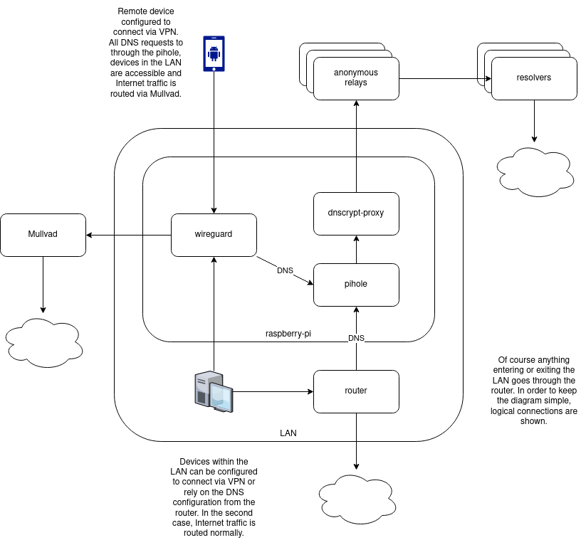

# ansible-raspberrypi

## Assumptions

1. You have installed [Raspberry Pi OS](https://www.raspberrypi.org/software/).
2. You can connect to the raspberry-pi.
3. The raspberry-pi can reach the Internet.
4. You have configured a static IP address for your raspberry-pi.
5. You have [created an SSH key pair](https://www.digitalocean.com/community/tutorials/how-to-set-up-ssh-keys-2#step-one%E2%80%94create-the-rsa-key-pair) and [copied the public key onto the rasberry-pi](https://www.digitalocean.com/community/tutorials/how-to-set-up-ssh-keys-2#step-three%E2%80%94copy-the-public-key) for a non-root user.
6. You have Ansible installed or otherwise available.
7. If you want to configure WireGuard, you have configured [port-forwarding](https://docs.pi-hole.net/guides/vpn/wireguard/server/#forward-port-on-your-router) and [dynamic DNS](https://docs.pi-hole.net/guides/vpn/wireguard/server/#set-up-a-domain-name-for-your-router) on your router.
8. If you want to configure Mullvad, you have a Mullvad account and have [downloaded a WireGuard configuration file](https://mullvad.net/download/config/) locally.

## What Will Be Configured

1. [SSHD](https://linux.die.net/man/5/sshd_config)
    - Basic secure measures like disabling password authentication and root login.
1. [Pi-hole](https://pi-hole.net/)
2. [dnscrypt-proxy](https://github.com/DNSCrypt/dnscrypt-proxy) (optional)
    - Anonymous relays
3. [WireGuard](https://www.wireguard.com/) (optional)
    - Local devices accessible
    - Tunnel all Internet traffic to the raspberry-pi
4. [Mullvad](https://mullvad.net/) (optional, requires WireGuard)
    - Tunnel all Internet traffic to Mullvad (instead of to the raspberry-pi)

### What Will Not Be Configured

Besides all of the assumptions, this does not configure WireGuard clients. Check [the Pi-hole guide](https://docs.pi-hole.net/guides/vpn/wireguard/client/#copy-config-file-to-client) for that.

### Credit

Aside from the documentation already linked, I borrowed the `iptables` configuration from [u/Annonymoiuse on Reddit](https://old.reddit.com/r/WireGuard/comments/g6yc1z/how_to_setup_wireguard_via_pihole_through_vpn/).

## Network Diagram

## Variables

There are default variables in each role, you should explore those.

The following variables are in `./vars.yml` and you must set them:

| Variable              | Description | Example
|-                      |-            |-
|net_interface          |The interface the raspberry-pi is listening on.        |"eth0"
|fallback_ipv4_dns1     |DNS server to use in case the dnscrypt-proxy servers are unavailable or dnscrypt-proxy is not used. |"1.1.1.1"
|fallback_ipv4_dns2     |DNS server to use in case the dnscrypt-proxy servers are unavailable or dnscrypt-proxy is not used. |"1.0.0.1"
|pi_webpassword         |Plaintext password for the Pi-hole web-ui.             |"myReallyGoodPassword27"
|pi_ipv4_addr           |IPv4 address of the raspberry-pi **with the mask**.    |"192.168.100.53/24"
|pi_ipv6_addr           |IPv6 address of the raspberry-pi.                      |"2345:0425:2CA1:0000:0000:0567:5673:23b5"
|wg_local_cidr          |Your local subnet.                                     |"192.168.100.0/24"
|wg_listen_endpoint     |Dynamic DNS entry for the raspberry-pi.                |"pi.example.com"
|wg_mullvad_interface   |Name you want to give the Mullvad interface.           |"mullvad-us7"
|wg_mullvad_conf        |Path to the Mullvad config file you downloaded.        |"~/Downloads/mullvad-us7.conf"
|wg_peers               |List of peers to create WireGuard configurations for.  |(see `./vars.yml`)

## Warnings

The commands to generate the WireGuard secrets are not idempotent. If you lose one of the created files, new values will be generated when Ansible runs again and you will likely need to reconfigure your clients.

dnscrypt-proxy is configured to use all relays and all resolvers. This may not be optimal.

If you plan to connect a device within the LAN via WireGuard, you should edit the client config file to use the local IP instead of the dynamic DNS entry.

**When the dynamic DNS entry changes** you will need to disconnect and re-connect remote devices. Wireguard only resolves DNS enties once.

## Running

1. Clone this repo.
2. Update `./hosts` with the local IP of the raspberry-pi.
3. Update `./vars.yml`.
3. Run `make apply` (and hope it works).
4. Test that you can resolve DNS entries.
    - `dig google.com @<rapsberry-pi-addr>`
5. Update your router to use the rapsberry-pi.
6. Connect clients to WireGuard.